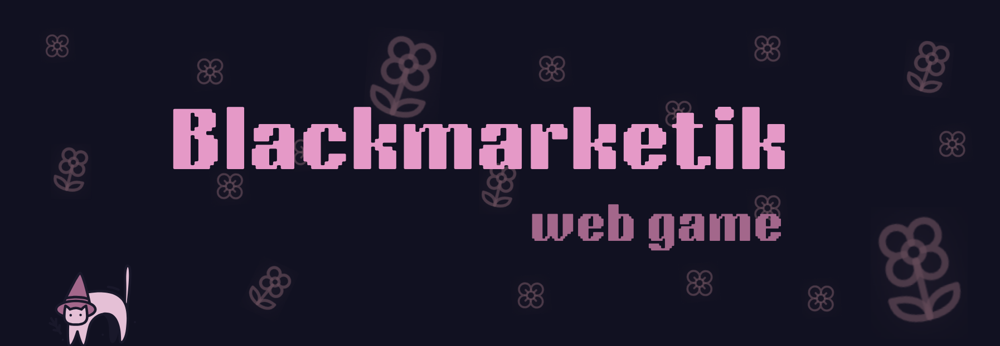

<div align="center">
  
  <br />
  <h3><i>Get ready for the heists!! :3</i></h3>
  <p>Buy special combos to improve your chances to succeed (you can also go get a job if u're one of those...)</p>
</div>

## 💡 Concept

Basically an economy sim, where players manage money, buy specialized gear from marketplace, complete 'real-life' contracts, and execute heists using items they've purchased!

## 💻 Tech Stack

<div align="center">
  
**Frontend** <br />


**Backend & Database** <br />


</div>

## 👾 Functionalities
* **User Accounts**: players create an account (or log in) and start with $150
* **The Marketplace**: browsing items and buying them (this adds items to their inventories)
* **The Inventory**: players can view their purchases and choose up to 2 items as their gear for the next heist
* **Contracts (passive income)**: once started, a job gets locked for 1 hour, while the payout is added to a queue and processed automatically
* **Heists**: the heist is selected randomly. When player triggers mechanic, the server calculates success rate based on the stats of the items equipped (Combat, Hacking, Stealth) and heist's difficulty. Used items are removed from inventory and successful heists bring a fat paycheck <3

## ❗ There are also all of OP labs implemented:

* **Random generator** for random heist displayed
* **Memoization function:** used to optimize database, now the server contacts with DB once a minute
* **Priority queue:** when player clicks 'go to work' the job is added to the queue. When multiple are queued, the one with the highest pay gets completed first
* **Async array:** multiple uses throughout the project
* **Large data processing:** generators `heistHistory` and `filterSuccessful` create a stream and filter database, and route `/analytics/successful-heists` shows a summary of all successful heists ever completed
* **Reactive communication:** `window.dispatchEvent()` to add an event, `window.addEventListener()/window.removeEventListener()` to subscribe/unsubscribe. Those are used to dynamically change money and inventory items displayed
* **Authentication** using JWT tokens, which are later stored in local storage
* **Logging decorator:** custom decorator (`@Log`). Every time a player tries to buy an item, the exact arguments (wallet amount, price) are logged to console with timestamps

Phew...

## 🚀 Getting Started

```javascript
git clone https://github.com/setlors/blackmarketik.git
```
1. Set up the Environment Variables:
create a .env file inside of server folder and add your MongoDB connection string inside it: `DATABASE_URL="your_connection_string"`

2. Set up the server:

  ```javascript
  cd server
  npm install
  npm run dev
  ```

3. Set up frontend:

  ```javascript
  cd frontend
  npm install
  npm run dev
  ```

🐽